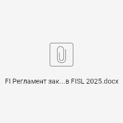

# 📘 FISL Регламент закрытия по налогу на прибыль 2025
## 📝 **Закрытие периода в FISL версия от 01.01.2025**

- В начале года требуется перенос сальдо на начало следующего года для ПБУ18 и ДМС/НС. Транзакция GVTR. Вариант запуска :
- Вариант ДМС/НС– для страхования
- Вариант ПБУ18 – для ПБУ для 1700, 2200, 2600, 3500, 6200 Инструкция 239-[7.2](https://know.pharmstd.ru/pages/viewpage.action?pageId=34280988)
- Транзакция GP12N – ввод ставок нормирования, ввод ставок налога на прибыль, ввод данных 00200-320 декларации за 9 месяцев. Инструкция 238-[7.1](https://know.pharmstd.ru/pages/viewpage.action?pageId=34298916), 239-[6.2](https://know.pharmstd.ru/pages/viewpage.action?pageId=34280988)
- При заключении новых договоров по страхованию заполнить наборы ДМС и НС. Транзакция GS02. Инструкция 238-[6.1](https://know.pharmstd.ru/pages/viewpage.action?pageId=34298916)

| **№** | **Код и название** **Шага процесса** | **Код транзакции** | **Краткое описание запуска транзакции** | **Примечание** | **Инструкция - № п** | **Комментарии** |
| ---------------------------------------- | ------------------------------------------------------------------------------------------------------------------- | -------------------------------------------- | -------------------------------------------------------------------------------------------------------------------------------------------------------------------------------------------------------------------------------------------------------------------------------------------------------------------------------------------------------------------------------------------------------------------------------------- | ---------------------------------------------------------------------------------------------------------------------------------------------------------------------------- | ------------------------------------------------------------------------------------------------------------------------------------------------------------------- | ---------------------------------------------------------------------------------------------------------------------------------------------------------- |
| **1. Процедура закрытия периода в FISL** |  /  |  /  |  /  |  /  |  /  |  /  |
| 1, | Проверка перенесенных документов | GCAC | 6200,2200, 2600, 3500, 1700 | В столбце „Разница” по всем счетам должны быть 0,00 | 239-[5.2](https://know.pharmstd.ru/pages/viewpage.action?pageId=34280988) | Проверка проводится до закрытия контроллинга для корректного расчета себестоимости |
| 2, | Проверка корректности сбора данных | GD13, GD20 | Код нолог. Объекта – UNC* | На элементе UNCLASS данных быть не должно | 239—[5.3](https://know.pharmstd.ru/pages/viewpage.action?pageId=34280988) | Проверка проводится до закрытия контроллинга для корректного расчета себестоимости |
| 3, | Сверка сбора данных | ZTAX_REG | БЕ 6200, 2200, 2600, 3500, 1700 С периода – отчетный период По период – отчетный период Финансовый год – текущий год | Выбираем отчет «Затраты периода» | 239—[5.1](https://know.pharmstd.ru/pages/viewpage.action?pageId=34280988) 239-[6.1](https://know.pharmstd.ru/pages/viewpage.action?pageId=34280988) | Проверка проводится до закрытия контроллинга для корректного расчета себестоимости |
| 4, | Сверка сбора данных НИОКР собственный | CJI3 (S_ALR_87013542) | Вариант НУ НИОКР СОБСТ БЕ 6200, 2200, 2600, 3500, 1700 | Равен строке «Итого первичных затрат» столбца «НУ НИОКР СОБСТ» в ZTAX_REG | 239—[5.1](https://know.pharmstd.ru/pages/viewpage.action?pageId=34280988) 239-[6.1](https://know.pharmstd.ru/pages/viewpage.action?pageId=34280988) | Проверка проводится до закрытия контроллинга для корректного расчета себестоимости |
| 5, | Сверка сбора данных НИОКР на сторону | CJI3 (S_ALR_87013542) | Вариант НУ НИОКР НА СТ | Равен строке «Итого первичных затрат» столбца «НУ НИОКР НА СТ» в ZTAX_REG | 239—[5.1](https://know.pharmstd.ru/pages/viewpage.action?pageId=34280988) 239-[6.1](https://know.pharmstd.ru/pages/viewpage.action?pageId=34280988) | Проверка проводится до закрытия контроллинга для корректного расчета себестоимости |
| 6, | Сверка сбора данных CAPEX | CJI3 (S_ALR_87013542) | Вариант НУ CAP БЕ 6200, 2200, 2600, 3500, 1700 | Равен строке «Итого первичных затрат» столбца «НУ CAP» в ZTAX_REG | 239—[5.1](https://know.pharmstd.ru/pages/viewpage.action?pageId=34280988) 239-[6.1](https://know.pharmstd.ru/pages/viewpage.action?pageId=34280988) | Проверка проводится до закрытия контроллинга для корректного расчета себестоимости |
| 7, | Сверка сбора данных расходов подлежащих перевыставлению | S_ALR_87012993 | Контроллинговая единица PHST / 1000 | Равен строке «Итого первичных затрат» столбца «Перевыстав» в ZTAX_REG | 239—[5.1](https://know.pharmstd.ru/pages/viewpage.action?pageId=34280988) 239-[6.1](https://know.pharmstd.ru/pages/viewpage.action?pageId=34280988) | Проверка проводится до закрытия контроллинга для корректного расчета себестоимости |
| 8, | Сверка сбора данных ТЗР на 10 счет | S_ALR_87013611 | Контроллинговая единица PHST Оценка по факту 5 МВЗ 2290001020 2690001020 3590001020 6290004000 6290006000 1790001020 Счет 3910001000 | Равен столбцу «Итого» строки «ТЗР на 10 счет» в ZTAX_REG | 239—[5.1](https://know.pharmstd.ru/pages/viewpage.action?pageId=34280988) 239-[6.1](https://know.pharmstd.ru/pages/viewpage.action?pageId=34280988) | Проверка проводится до закрытия контроллинга для корректного расчета себестоимости |
| 9, | Расчет ТЗР относящихся к расходам периода | ZFRUPTA_TZR | БЕ 6200 Отчетный период – ГГГГ ММ Процедура – TZR_GOODS для товаров TZR_PROD для ГП | «Тестовый прогон» Проверка расчета Без «Тестовый прогон» формируется проводка | 238-[5.1](https://know.pharmstd.ru/pages/viewpage.action?pageId=34298916) |  /  |
| 10, | Ведение набора договоров | GS02 | Для ДМС - ZTAX_DMS Для НС - ZTAX_NS БЕ - 6200 | Заполняется при заключении очередного основного договора (развгод) | 238-[6.1](https://know.pharmstd.ru/pages/viewpage.action?pageId=34298916) |  /  |
| 11, | Расчет разницы по страхованию между платежом и затратами | ZTAX_INSURE_CARGO | Все БЕ - Договор – D* | Выполнить | 238-[6.1](https://know.pharmstd.ru/pages/viewpage.action?pageId=34298916) |  /  |
| 12, | Формирование отчета по ДМС и НС, формирование проводки 97 / 32 по НУ | ZTAX_INSURE | Все БЕ Год – текущий год С периода – с периода формирования По период - текущий период Процедура – NORM_INSDMS ДМС NORM_INSNS НС Договор – подтягивается для выбора после выбора процедуры | После вывода отчета в формате ALV и проверки данных по пиктограмме Провести документ формируем проводку 97 / 32 по N1 | 238-[6.1](https://know.pharmstd.ru/pages/viewpage.action?pageId=34298916) | Проводка попадает в ЭНУ EXP01-030-02-01-02 Долгосрочное страх-е жизни и пенсионное страх-е97* и EXP01-030-02-02-02 Добровольное медицинское страхование97* |
| 13, | Сторно проводок отклонений предыдущего месяца | FB08 единичный документ F.80 массовое сторно | Номер документа, год, БЕ 6200 **Причина сторно 04** | Если по страхованиям в предыдущем месяце было превышение затрат над оплатами, и были сформированы проводки 97 / 32 на суммы данных отклонений, то их необходимо сторнировать |  /  |  /  |
| 14, | Заведение ставок нормирования / ставки налога на прибыль / суммы строки 00200-320 ДНП за 9 месяцев предыдущего года | GP12N | Формат ZPTANORM01- Ставки нормированияФормат - ZPTANORM03- Cтавки налогаZPTANORM06- Ставки ФИНВ (2200/2600/3500)Формат - ZPTANORM05ZPTANORM07- 00205-080 пред год (6200)Флаг – по формуляру | Форматы можно заполнить на весь год в январе. | 238-[7.1](https://know.pharmstd.ru/pages/viewpage.action?pageId=34298916) |  /  |
| 15, | Расчет нормируемых затрат | J3RTAXCE | Код цепочки – PTANORM Финансовый год – текущий Периода проводки С – текущий Период проводки По – текущий БЕ - 6200 | Цепочку запускать в фоновом режиме, за один месяц. Проверить окончание расчета цепочки в транзакции SM37. | 238-[7](https://know.pharmstd.ru/pages/viewpage.action?pageId=34298916).3 |  /  |
| 16, | Формирование отчета по расчету нормируемых расходов | ZTAX_NORM | Финансовый год – текущий БЕ – 6200 Период – период запуска отчета |  /  | 238-[7](https://know.pharmstd.ru/pages/viewpage.action?pageId=34298916).4 |  /  |
| 17, | Проводка суммы превышения расходов над лимитом | FB01L | Проводку в N1 Дт 97 / Кт 32015* | [Сумма из отчета п.15 столбец «превышение»](#п15) |  /  | EXP01-100-30 Превышение по нормируемым |
| 18, | Исправление некорректно проведенных документы НОБ | ZFRUPTA_TOTALS | БЕ 6200 Отчетный период – ГГГГ MM Счет главной книги – счет подлежащий корректировке | Исправить Элемент налогового учета на НР-270 | [235-12](https://know.pharmstd.ru/pages/viewpage.action?pageId=24445241) | Документ перезагружается в НУ автоматически |
| 19, | Удаление некорректного документа в НУ | ZTAX_DE | Регистр - JT Вид записи – 0 Балансовая единица – 6200, 2200, 2600, 3500, 1700 Финансовый год – текущий Номер документа – номер документа Специальных регистров |  /  | 235-[14](https://know.pharmstd.ru/pages/viewpage.action?pageId=24445241) |  /  |
| 20, | Перенос корректного документа в НУ | GCU1 | Балансовая единица – 6200, 2200, 2600, 3500, 1700 Финансовый год – текущий Номер документа – номер перезаливаемого документа Тестовый прогон – снять Целевой регистр - JT |  /  | 235-[9](https://know.pharmstd.ru/pages/viewpage.action?pageId=24445241) |  /  |
| 21, | Расчет нормы по НИОКР давшим и не давшим положительный результат | ZTAX_NIOKR_NORM | БЕ / год / период | Программа с пиктограммой для формирования проводки по переносу затрат сверх норм в косвенные затраты | [241](https://know.pharmstd.ru/pages/viewpage.action?pageId=34292458) | С 2025 года |
| 22, | Отнесение косвенных затрат производственных подразделений и косвенных затрат СПП на сторону к затратам периода | ZFI_KSV | БЕ 6200, 2200, 2600, 3500, 1700 Первичные затраты | При выполнении закрытия контроллинга при шаге списания косвенных первичных запускать последовательно первые три радиобаттона первичные затраты | 239—[5.5](https://know.pharmstd.ru/pages/viewpage.action?pageId=34280988) |  /  |
| 23, | Отнесение косвенных затрат производственных подразделений и косвенных затрат СПП на сторону к затратам периода | ZFI_KSV | БЕ 6200, 2200, 2600, 3500, 1700 Вторичные затраты | При выполнении закрытия контроллинга при шаге списания косвенных вторичных затрат запускать последовательно радиобаттоны вторичных затра | 239—[5.5](https://know.pharmstd.ru/pages/viewpage.action?pageId=34280988) |  /  |
| 24, | Сверка сбора данных | ZTAX_REG | БЕ 6200, 2200, 2600, 3500, 1700 С периода – отчетный период По период – отчетный период Финансовый год – текущий год | Выбираем отчет «Затраты периода» | 239—[5.1](https://know.pharmstd.ru/pages/viewpage.action?pageId=34280988) 239-[6.1](https://know.pharmstd.ru/pages/viewpage.action?pageId=34280988) | Повторная сверка после закрытия контроллинга для исключения переносов не разобранных в НУ и влияющих на сумму НП |
| 25, | Сверка сбора данных НИОКР собственный | CJI3 (S_ALR_87013542) | Вариант НУ НИОКР СОБСТ БЕ 6200, 2200, 2600, 3500, 1700 | Равен строке «ИТОГО» столбца «НУ НИОКР СОБСТ» в ZTAX_REG | 239—[5.1](https://know.pharmstd.ru/pages/viewpage.action?pageId=34280988) 239-[6.1](https://know.pharmstd.ru/pages/viewpage.action?pageId=34280988) | Повторная сверка после закрытия контроллинга для исключения переносов не разобранных в НУ и влияющих на сумму НП |
| 26, | Сверка сбора данных НИОКР на сторну | CJI3 (S_ALR_87013542) | Вариант НУ НИОКР НА СТ БЕ 6200, 2200, 2600, 3500, 1700 | Равен строке «ИТОГО» столбца «НУ НИОКР НА СТ» в ZTAX_REG | 239—[5.1](https://know.pharmstd.ru/pages/viewpage.action?pageId=34280988) 239-[6.1](https://know.pharmstd.ru/pages/viewpage.action?pageId=34280988) | Повторная сверка после закрытия контроллинга для исключения переносов не разобранных в НУ и влияющих на сумму НП |
| 27, | Сверка сбора данных CAPEX | CJI3 (S_ALR_87013542) | Вариант НУ CAP БЕ 6200, 2200, 2600, 3500, 1700 | Равен строке «ИТОГО» столбца «НУ CAP» в ZTAX_REG | 239—[5.1](https://know.pharmstd.ru/pages/viewpage.action?pageId=34280988) 239-[6.1](https://know.pharmstd.ru/pages/viewpage.action?pageId=34280988) | Повторная сверка после закрытия контроллинга для исключения переносов не разобранных в НУ и влияющих на сумму НП |
| 28, | Сверка сбора данных расходов подлежащих перевыставлению | S_ALR_87012993 | Контроллинговая единица PHST | Равен строке «ИТОГО» столбца «Перевыстав» в ZTAX_REG | 239—[5.1](https://know.pharmstd.ru/pages/viewpage.action?pageId=34280988) 239-[6.1](https://know.pharmstd.ru/pages/viewpage.action?pageId=34280988) | Повторная сверка после закрытия контроллинга для исключения переносов не разобранных в НУ и влияющих на сумму НП |
| 29, | Сверка сбора данных ТЗР на 10 счет | S_ALR_87013611 | Контроллинговая единица PHST Оценка по факту 5 МВЗ 2290001020 2690001020 3590001020 6290004000 6290006000 1790001020 Счет 3910001000 | Равен столбцу «Итого» строки «ТЗР на 10 счет» в ZTAX_REG | 239—[5.1](https://know.pharmstd.ru/pages/viewpage.action?pageId=34280988) 239-[6.1](https://know.pharmstd.ru/pages/viewpage.action?pageId=34280988) |  /  |
| 30, | Расчет затрат на энергию | ZFI_TARIFF | Все БЕ |  /  | 239-[5.6](https://know.pharmstd.ru/pages/viewpage.action?pageId=34280988) |  /  |
| 31, | Расчет данных для декларации | J3RTAXCE | Код налогов.Цепочки БЕ 6200 - TAXDECLR1, TAXDECLR2, TAXDECLOP (длязаводовимеющихОП)Цепочки БЕ 1700TAXDEC07,TAXDEC17, (РаспределениезатратпоИНВЕСТдекл), TAXDECLR2 для БЕ 1700TAXD17 (безраспределенияпоИНВЕСтдекларациям), TAXDECLR2Цепочки БЕ 2200, 2600, 3500 - TAXDECLR1, TAXDECLR3 (применениеФИНВ)Финансовый год – текущий годС периода – отчетный периодПо период – отчетный периодБЕ - 6200, 2200, 2600, 3500, 1700 | **ВАЖНО!!!** **Выполнять налоговую цепочку, ежемесячно, за текущий месяц.** **Рекомендуется в фоновом режиме.** | 239-[6.2](https://know.pharmstd.ru/pages/viewpage.action?pageId=34280988) |  /  |
| 32, | Система учетов по налогу на прибыль – формирование ДНП | J3RTAXDC | Регистр JF Версия 4 БЕ 6200, 2200, 2600, 3500, 1700 Формат / ДНП2020 Регистр JF Версия 4 Для 1700 БЕ две декларации БЕ 1700 Версия 5 Формат / ДНП0 |  /  | 239-[6.2](https://know.pharmstd.ru/pages/viewpage.action?pageId=34280988) |  /  |
| 33, | Декларация по налогу на прибыль (XMK) | ZJ3RTAXDC |  /  |  /  | 239-[6.3](https://know.pharmstd.ru/pages/viewpage.action?pageId=34280988&preview=/34280988/100407667/ПБУ18%20Налоговый%20учет%202022_v7.0.docx) |  /  |
| 34, | Расчет разниц для ПБУ18 для проводки по ГГК | J3RTAXCE | Код налогов. Цепочки - ZPBU Финансовый год – текущий год С периода – отчетный период По период – отчетный период БЕ - 6200, 2200, 2600, 3500, 1700 | **ВАЖНО!!!** **Выполнять налоговую цепочку, ежемесячно, за текущий месяц, по очереди.** **Только в фоновом режиме.** | 239-[7,1](https://know.pharmstd.ru/pages/viewpage.action?pageId=34280988) |  /  |
| 35, | Сверка сбора данных по ПБУ18 | ZPBU_REG | БЕ 6200, 2200, 2600, 3500, 1700 С периода – отчетный период По период – отчетный период Финансовый год – текущий год |  /  | 239-[9](https://know.pharmstd.ru/pages/viewpage.action?pageId=34280988) |  /  |
| 36, | Программа проводки разниц | J3RPBU18DP | БЕ – 6200, 2200, 2600, 3500, 1700 Регистр Версия – 1 Вид записи – 0 Ид. Присвоения иерархии – 002 Код объекта разницы – PBU* Сгенерировать проводки – флаг |  /  | 239-[8](https://know.pharmstd.ru/pages/viewpage.action?pageId=34280988) |  /  |

