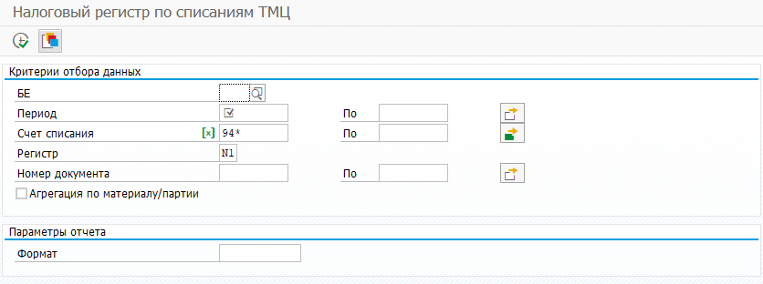
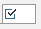
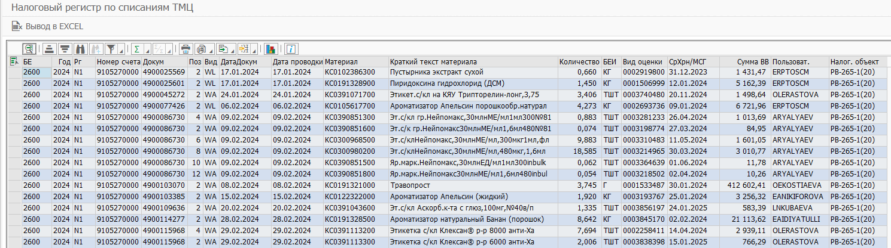
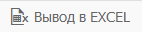
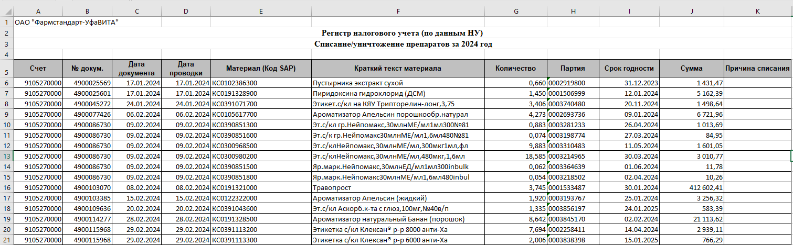

# Назначение

Настоящая инструкция описывает порядок действий по работе с налоговым регистром по списаниям МПЗ в транзакции ZFI_RELEASE. Данный регистр показывает все операции по счетам, указанным на селекционном экране, за отчетный период, с указанием материала, партии и срока годности.
Перед работой следует внимательно ознакомиться с настоящей инструкцией.
# Область применения

Данная инструкция применима для работы с транзакцией ZFI_RELEASE.
# Нормативные ссылки

- GSOP-FSOFT-STD-003 "Требования к оформлению проектно-технических документов для компьютеризированных систем".
# Термины, определения и сокращения

- **Термины и Определения:**
н/п
# Порядок действий

# Налоговый регистр по списаниям МПЗ

Запустить транзакцию ZFI_RELEASE и указать в параметрах формирования отчета на селекционном экране:

Параметры транзакции

Критерии выбора:
- БЕ – ограничения на балансовую единицу;
- Период – требуемый отчетный период;
- Счет списания – ограничения по счетам бухгалтерского учета, которые включаются в регистр. По умолчанию заполнены счета 9105270000, 9105280000, 94*;
- Регистр – требуемый отчетный регистр, по умолчанию заполнен N1 «Книга учета налога на прибыль». Также можно указывать регистры 0L или I1;
- Номер документа – ограничения на номера документов, как правильно не указывается;
- Агрегация по материалу/партии – если опция не активирована, то выводится обычный список документов за отчетный период. Если опция активирована, то осуществляется агрегация документов по материалу/партии;
- Формат – при необходимости, можно выбрать ранее сохраненный формат вывода ALV.

Просмотр отчета в формате ALV
Поля доступные для вывода в ALV
| **Название поля** | **Описание** |
| ------------------------- | -------------------------------------- |
| БЕ | Балансовая единица |
| Год | Финансовый год |
| Регистр | Регистр |
| Номер счета | Бухгалтерский счет |
| Документ | Номер бухгалтерского документа |
| Позиция | Позиция бухгалтерского документа |
| Вид | Вид документа |
| Дата документа | Дата документа |
| Дата проводки | Дата проводки |
| Материал | Код материала |
| Краткий текст материала | Наименование материала |
| Количество | Количество материала |
| Базовая единица измерения | Единица измерения количества материала |
| Вид оценки | Партия |
| Срок хранения/МСГ | Срок годности |
| Сумма ВВ | Сумма в рублях |
| Пользователь | Имя пользователя, создавшего документ |
| Налоговый объект | Налоговый объект |

